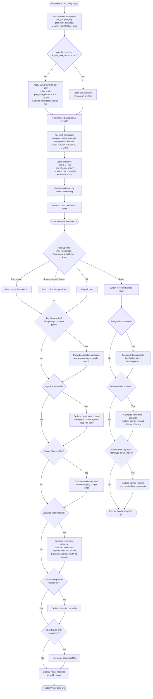

# Activity Diagram: Discovery Preferences & Filters Logic

```mermaid
flowchart TD
    A([User opens Discovery page]) --> B[Fetch current user profile\npref_lat, pref_lng, pref_max_distance,\nv_wd, v_we, lifestyle_tags]

    B --> C{pref_lat, pref_lng\n& pref_max_distance set?}

    C -- Yes --> D[Apply SQL bounding box filter\nbuffer = min pref_max_distance × 2, 100km\nExclude candidates outside box]
    C -- No --> E[Fetch all candidates\nno location pre-filter]

    D --> F[Fetch filtered candidates from DB]
    E --> F

    F --> G[For each candidate:\ncompute match score via computeMatchResult\nv_wd A, v_we A, v_wd B, v_we B]

    G --> H[Score produces:\n• score 0–100\n• tier: strong / good / borderline / incompatible\n• conflicts array]

    H --> I[Sort all candidates by score descending]
    I --> J[Return scored matches to client]

    %% ── Client-side filtering ─────────────────────────────────────────
    J --> K([User interacts with filter UI])

    K --> L{Role type filter\nAll / Roommate /\nRoommate with Room / Room}
    L -- Roommate --> M[Keep only role = seeker]
    L -- Roommate with Room --> N[Keep only role = provider]
    L -- All --> O[Keep all roles]
    L -- Room --> P[Switch to Room Listings view]

    M & N & O --> Q{Tag filters active?\nlifestyle tags or same gender}
    Q -- Yes --> R[Exclude candidates missing\nany required tag or gender match]
    Q -- No --> S

    R --> S{Age filter enabled?}
    S -- Yes --> T[Exclude candidates outside\nfilterAgeMin – filterAgeMax\nkeep null ages]
    S -- No --> U

    T --> U{Budget filter enabled?}
    U -- Yes --> V[Exclude candidates with\nnon-overlapping budget range]
    U -- No --> W

    V --> W{Distance filter enabled?}
    W -- Yes --> X[Compute Haversine distance\nExclude candidates beyond filterMaxDist km\nExclude candidates with no coords]
    W -- No --> Y

    X --> Y{showIncompatible\ntoggled on?}
    Y -- No --> Z[Exclude tier = incompatible]
    Y -- Yes --> AA

    Z --> AA{showSaved only\ntoggled on?}
    AA -- Yes --> AB[Keep only saved profiles]
    AA -- No --> AC

    AB --> AC[Display visible matches\nsorted by score]
    AC --> AD([Render ProfileCard grid])

    %% ── Room Listings branch ──────────────────────────────────────────
    P --> RE{Budget filter enabled?}
    RE -- Yes --> RF[Exclude listings outside\nfilterBudgetMin – filterBudgetMax]
    RE -- No --> RG

    RF --> RG{Distance filter enabled?}
    RG -- Yes --> RH[Compute Haversine distance\nExclude listings beyond filterMaxDist km]
    RG -- No --> RI

    RH --> RI{Active room tag filters\nroom type or amenities?}
    RI -- Yes --> RJ[Exclude listings missing\nany required tag or amenity]
    RI -- No --> RK

    RJ --> RK([Render RoomListingCard grid])
```
