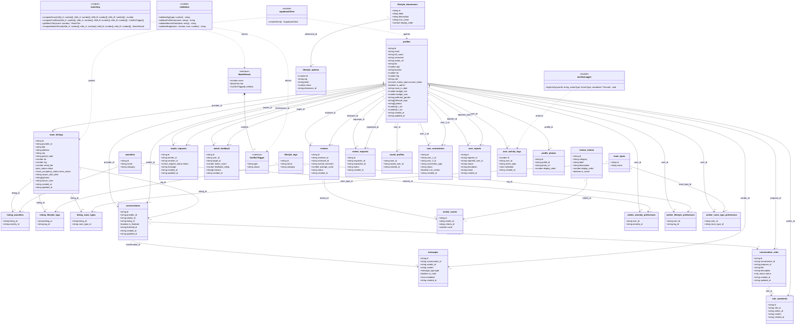

# Class Diagram

```mermaid
classDiagram

    %% ─── CORE ENTITIES ───────────────────────────────────────────
    class profiles {
        +string id
        +string email
        +string full_name
        +string username
        +string avatar_url
        +string bio
        +number age
        +string location
        +number lat
        +number lng
        +string role
        +account_status_type account_status
        +boolean is_admin
        +string move_in_date
        +number budget_min
        +number budget_max
        +string preferred_gender
        +string[] lifestyle_tags
        +string[] photos
        +number[] v_wd
        +number[] v_we
        +string created_at
        +string updated_at
    }

    %% ─── ROOM LISTING ─────────────────────────────────────────────
    class room_listings {
        +string id
        +string provider_id
        +string title
        +string address
        +string city
        +string postal_code
        +number lat
        +number lng
        +number rental_fee
        +post_status status
        +room_occupancy_status room_status
        +string vacant_start_date
        +string[] photos
        +string house_rules
        +string created_at
        +string updated_at
    }

    class amenities {
        +string id
        +string name
        +string category
    }

    class room_types {
        +string id
        +string name
    }

    class lifestyle_tags {
        +string id
        +string name
        +string category
    }

    class listing_amenities {
        +string listing_id
        +string amenity_id
    }

    class listing_lifestyle_tags {
        +string listing_id
        +string tag_id
    }

    class listing_room_types {
        +string listing_id
        +string room_type_id
    }

    %% ─── MATCHING ──────────────────────────────────────────────────
    class match_requests {
        +string id
        +string sender_id
        +string receiver_id
        +match_request_status status
        +string message
        +string created_at
        +string updated_at
    }

    class match_feedback {
        +string id
        +string user_id
        +string target_id
        +number match_score
        +number feedback_rating
        +string[] reasons
        +string created_at
    }

    class MatchResult {
        <<interface>>
        +number score
        +MatchTier tier
        +ConflictTrigger[] conflicts
    }

    class ConflictTrigger {
        <<interface>>
        +string type
        +string clause
    }

    class matching {
        <<module>>
        +computeScore(vWd_A: number[], vWe_A: number[], vWd_B: number[], vWe_B: number[]) number
        +computeConflicts(vWd_A: number[], vWe_A: number[], vWd_B: number[], vWe_B: number[]) ConflictTrigger[]
        +getMatchTier(score: number) MatchTier
        +computeMatchResult(vWd_A: number[], vWe_A: number[], vWd_B: number[], vWe_B: number[]) MatchResult
    }

    class validation {
        <<module>>
        +validateAge(age: number) string
        +validateFullName(name: string) string
        +validateMoveInDate(date: string) string
        +validateBudget(min: number, max: number) string
    }

    class activityLogger {
        <<module>>
        +logActivity(userId: string, actionType: ActionType, metadata?: Record) void
    }

    class supabaseClient {
        <<module>>
        +createClient() SupabaseClient
    }

    %% ─── MESSAGING ─────────────────────────────────────────────────
    class conversations {
        +string id
        +string provider_id
        +string seeker_id
        +string listing_id
        +boolean is_finalized
        +string finalized_at
        +string created_at
        +string updated_at
    }

    class messages {
        +string id
        +string conversation_id
        +string sender_id
        +string content
        +message_type type
        +boolean is_read
        +Json metadata
        +string created_at
    }

    class conversation_rules {
        +string id
        +string conversation_id
        +string proposer_id
        +string title
        +string description
        +rule_status status
        +string created_at
        +string updated_at
    }

    class rule_comments {
        +string id
        +string rule_id
        +string author_id
        +string content
        +string created_at
    }

    %% ─── REVIEWS ───────────────────────────────────────────────────
    class reviews {
        +string id
        +string reviewer_id
        +string reviewee_id
        +string overall_comment
        +number average_score
        +string status
        +string created_at
    }

    class review_criteria {
        +string id
        +string category
        +string label
        +string description
        +number display_order
        +boolean is_active
    }

    class review_scores {
        +string id
        +string review_id
        +string criteria_id
        +number score
    }

    class review_requests {
        +string id
        +string requester_id
        +string requestee_id
        +string status
        +string created_at
    }

    %% ─── SOCIAL / USER ─────────────────────────────────────────────
    class saved_profiles {
        +string user_id
        +string saved_user_id
        +string created_at
    }

    class user_connections {
        +string id
        +string user_1_id
        +string user_2_id
        +string connection_type
        +string status
        +boolean can_review
        +string created_at
    }

    class user_reports {
        +string id
        +string reporter_id
        +string reported_user_id
        +string reason
        +string description
        +string status
        +string created_at
    }

    class user_activity_logs {
        +number id
        +string user_id
        +string action_type
        +Json metadata
        +string created_at
    }

    %% ─── SEEKER PREFERENCES ────────────────────────────────────────
    class seeker_amenity_preferences {
        +string user_id
        +string amenity_id
    }

    class seeker_lifestyle_preferences {
        +string user_id
        +string tag_id
    }

    class seeker_room_type_preferences {
        +string user_id
        +string room_type_id
    }

    %% ─── LIFESTYLE DIMENSIONS ──────────────────────────────────────
    class lifestyle_dimensions {
        +string id
        +string label
        +string description
        +string icon_name
        +number display_order
    }

    class lifestyle_options {
        +number id
        +string tag
        +string label
        +number value
        +string dimension_id
    }

    class profile_photos {
        +string id
        +string profile_id
        +string photo_url
        +number display_order
    }

    %% ─── RELATIONSHIPS ─────────────────────────────────────────────

    %% profiles → room listings
    profiles "1" --> "0..*" room_listings : provider_id

    %% room listing join tables
    room_listings "1" --> "0..*" listing_amenities : listing_id
    amenities "1" --> "0..*" listing_amenities : amenity_id
    room_listings "1" --> "0..*" listing_lifestyle_tags : listing_id
    lifestyle_tags "1" --> "0..*" listing_lifestyle_tags : tag_id
    room_listings "1" --> "0..1" listing_room_types : listing_id
    room_types "1" --> "0..*" listing_room_types : room_type_id

    %% matching
    profiles "1" --> "0..*" match_requests : sender_id
    profiles "1" --> "0..*" match_requests : receiver_id
    profiles "1" --> "0..*" match_feedback : user_id
    profiles "1" --> "0..*" match_feedback : target_id
    MatchResult "1" *-- "0..*" ConflictTrigger : conflicts

    %% messaging
    profiles "1" --> "0..*" conversations : provider_id
    profiles "1" --> "0..*" conversations : seeker_id
    room_listings "1" --> "0..*" conversations : listing_id
    conversations "1" --> "0..*" messages : conversation_id
    profiles "1" --> "0..*" messages : sender_id
    conversations "1" --> "0..*" conversation_rules : conversation_id
    profiles "1" --> "0..*" conversation_rules : proposer_id
    conversation_rules "1" --> "0..*" rule_comments : rule_id
    profiles "1" --> "0..*" rule_comments : author_id

    %% reviews
    profiles "1" --> "0..*" reviews : reviewer_id
    profiles "1" --> "0..*" reviews : reviewee_id
    reviews "1" --> "0..*" review_scores : review_id
    review_criteria "1" --> "0..*" review_scores : criteria_id
    profiles "1" --> "0..*" review_requests : requester_id
    profiles "1" --> "0..*" review_requests : requestee_id

    %% social
    profiles "1" --> "0..*" saved_profiles : user_id
    profiles "1" --> "0..*" user_connections : user_1_id
    profiles "1" --> "0..*" user_connections : user_2_id
    profiles "1" --> "0..*" user_reports : reporter_id
    profiles "1" --> "0..*" user_reports : reported_user_id
    profiles "1" --> "0..*" user_activity_logs : user_id
    profiles "1" --> "0..*" profile_photos : profile_id

    %% seeker preferences
    profiles "1" --> "0..*" seeker_amenity_preferences : user_id
    amenities "1" --> "0..*" seeker_amenity_preferences : amenity_id
    profiles "1" --> "0..*" seeker_lifestyle_preferences : user_id
    lifestyle_tags "1" --> "0..*" seeker_lifestyle_preferences : tag_id
    profiles "1" --> "0..*" seeker_room_type_preferences : user_id
    room_types "1" --> "0..*" seeker_room_type_preferences : room_type_id

    %% lifestyle dimensions
    lifestyle_dimensions "1" --> "0..*" lifestyle_options : dimension_id

    %% service layer
    matching ..> MatchResult : returns
    matching ..> ConflictTrigger : returns
    activityLogger ..> user_activity_logs : writes to
    supabaseClient ..> profiles : queries
    supabaseClient ..> room_listings : queries
```
