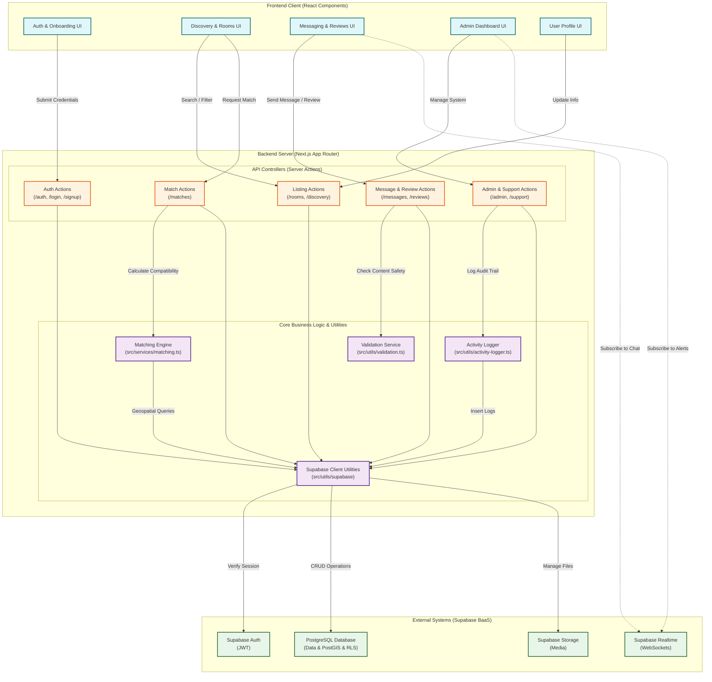

# SyncLiving Component Diagram

```mermaid
%%{init: {'theme': 'default', 'flowchart': {'nodeSpacing': 80, 'rankSpacing': 100}}}%%

graph TD
    %% Styling definitions
    classDef client fill:#e0f7fa,stroke:#006064,stroke-width:2px;
    classDef server fill:#fff3e0,stroke:#e65100,stroke-width:2px;
    classDef service fill:#f3e5f5,stroke:#4a148c,stroke-width:2px;
    classDef db fill:#e8f5e9,stroke:#1b5e20,stroke-width:2px;  

    subgraph ClientSide ["Frontend Client (React Components)"]
        UI_Auth["Auth & Onboarding UI"]:::client
        UI_Disc["Discovery & Rooms UI"]:::client
        UI_Msg["Messaging & Reviews UI"]:::client
        UI_Admin["Admin Dashboard UI"]:::client
        UI_Profile["User Profile UI"]:::client
    end
    
    subgraph NextJS ["Backend Server (Next.js App Router)"]
        subgraph ServerActions ["API Controllers (Server Actions)"]
            SA_Auth["Auth Actions\n(/auth, /login, /signup)"]:::server
            SA_Listing["Listing Actions\n(/rooms, /discovery)"]:::server
            SA_Match["Match Actions\n(/matches)"]:::server
            SA_Msg["Message & Review Actions\n(/messages, /reviews)"]:::server
            SA_Admin["Admin & Support Actions\n(/admin, /support)"]:::server
        end

        subgraph CoreLogic ["Core Business Logic & Utilities"]
            SVC_Match["Matching Engine\n(src/services/matching.ts)"]:::service
            SVC_Logger["Activity Logger\n(src/utils/activity-logger.ts)"]:::service
            SVC_Valid["Validation Service\n(src/utils/validation.ts)"]:::service
            SVC_DB["Supabase Client Utilities\n(src/utils/supabase)"]:::service
        end
    end
  
    subgraph External ["External Systems (Supabase BaaS)"]
        Supabase_Auth["Supabase Auth\n(JWT)"]:::db
        Supabase_DB["PostgreSQL Database\n(Data & PostGIS & RLS)"]:::db
        Supabase_RT["Supabase Realtime\n(WebSockets)"]:::db
        Supabase_Storage["Supabase Storage\n(Media)"]:::db
    end  

    %% Client to Server interactions
    UI_Auth ---->|Submit Credentials| SA_Auth
    UI_Disc ---->|Search / Filter| SA_Listing
    UI_Disc ---->|Request Match| SA_Match
    UI_Msg ---->|Send Message / Review| SA_Msg
    UI_Admin ---->|Manage System| SA_Admin
    UI_Profile ---->|Update Info| SA_Listing
  
    %% Direct Client to External (Realtime)
    UI_Msg -..->|Subscribe to Chat| Supabase_RT
    UI_Admin -..->|Subscribe to Alerts| Supabase_RT
  
    %% Server Actions to Core Logic
    SA_Match ---->|Calculate Compatibility| SVC_Match
    SA_Admin ---->|Log Audit Trail| SVC_Logger
    SA_Msg ---->|Check Content Safety| SVC_Valid
    SA_Auth ----> SVC_DB
    SA_Listing ----> SVC_DB
    SA_Match ----> SVC_DB
    SA_Msg ----> SVC_DB
    SA_Admin ----> SVC_DB
  
    %% Core Logic to External Systems
    SVC_Match ---->|Geospatial Queries| SVC_DB
    SVC_Logger ---->|Insert Logs| SVC_DB
    SVC_DB ---->|Verify Session| Supabase_Auth
    SVC_DB ---->|CRUD Operations| Supabase_DB
    SVC_DB ---->|Manage Files| Supabase_Storage
```
