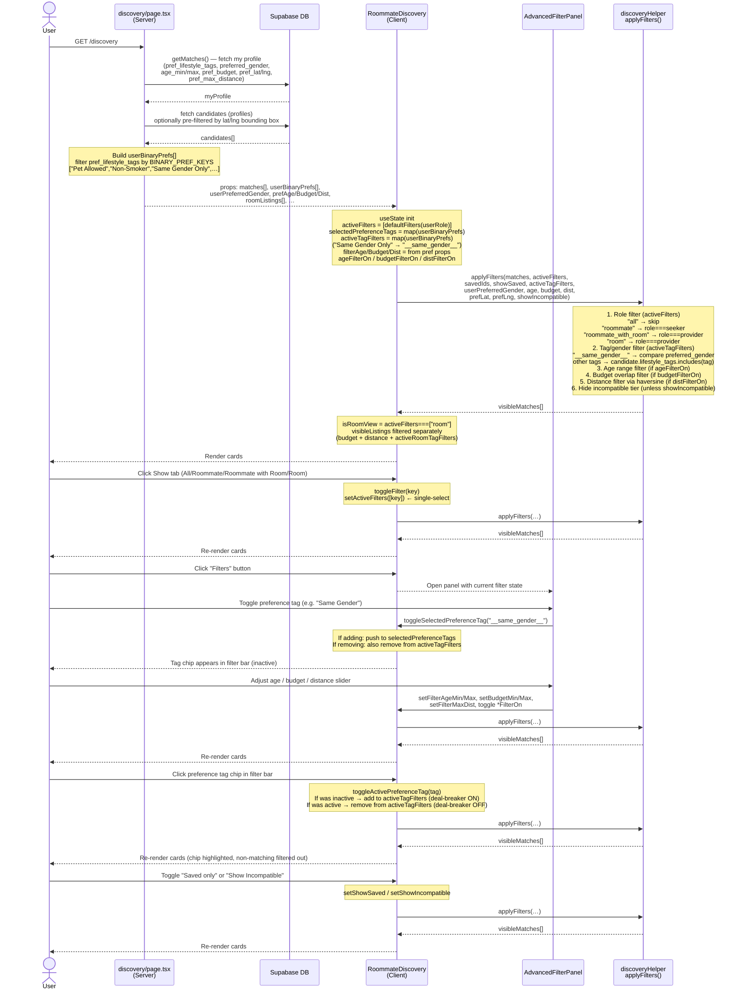

# Filter & Preferences Logic — Sequence Diagram

## State reference

| State | Initialised from | What it does |
|---|---|---|
| `activeFilters` | `defaultFilters(userRole)` | Single-select Show tab — controls role filter |
| `selectedPreferenceTags` | `userBinaryPrefs` (mapped) | Controls which tag chips appear in the filter bar |
| `activeTagFilters` | `userBinaryPrefs` (mapped) | Deal-breaker — profiles that don't match are removed |
| `filterAge/Budget/Dist` | saved pref columns | Numeric range filters; only applied when `*FilterOn` is true |
| `activeRoomTagFilters` | empty | Room-view only — filters by amenity/room type |
