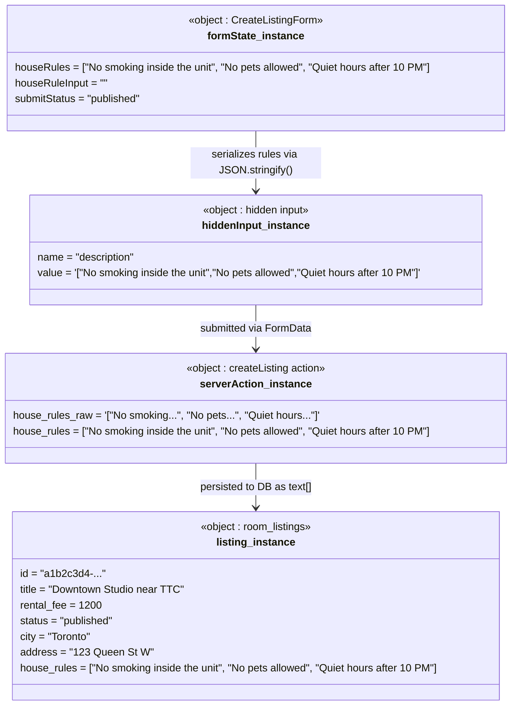

# Object Diagram: House Rules

Captures a snapshot of the system at the moment a provider has finished adding house rules and published a listing.

## Notes

| Object | Role |
| :--- | :--- |
| `CreateListingForm` | Client-side React state — holds the rules array while the user builds the listing |
| `hidden input` | Bridge between React state and the HTML form — carries `JSON.stringify(houseRules)` |
| `createListing action` | Server Action that parses the JSON string back into `string[]` before writing to Supabase |
| `room_listings` | Final persisted state — `house_rules` stored as a native `text[]` PostgreSQL array |
