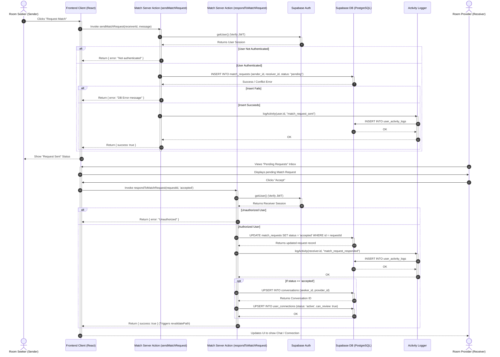

# Sequence Diagram: Mutual Consent Matching

This document details the step-by-step technical execution flow of the Mutual Consent Matching process, from the initial request to final acceptance and connection establishment.

## 1. Mermaid.js Sequence Diagram

## 2. Participants Breakdown

*   **Room Seeker (Sender)**: The user browsing the application who decides to initiate contact with another user or a room listing.
*   **Room Provider (Receiver)**: The user who receives the match request and has the authority to accept or decline it.
*   **Frontend Client (React)**: The Next.js Client Component running in the user's browser.
    *   **Responsibility**: Collects user actions (clicks), manages local UI state (loading spinners), and calls Server Actions.
    *   **Tech Stack**: React 19, Next.js App Router (Client-side).
*   **Match Server Action (`sendMatchRequest` / `respondToMatchRequest`)**:
    *   **Responsibility**: Acts as the backend API controller. Validates the incoming RPC request, checks authentication, interacts with the database, and returns the result securely to the frontend.
    *   **Tech Stack**: Next.js Server Actions (`'use server'`).
*   **Supabase Auth**:
    *   **Responsibility**: The identity provider that validates the JWT token accompanying the Server Action request to ensure the user is who they claim to be.
    *   **Tech Stack**: Supabase Auth (GoTrue).
*   **Supabase DB**:
    *   **Responsibility**: The central relational database enforcing Row Level Security (RLS) constraints and storing all state (requests, conversations, user connections).
    *   **Tech Stack**: PostgreSQL.
*   **Activity Logger**:
    *   **Responsibility**: A backend utility service (`src/utils/activity-logger.ts`) that records sensitive or important state changes to an audit table (`user_activity_logs`).
    *   **Tech Stack**: TypeScript, Node.js.

## 3. Step-by-Step Execution Flow

1.  **Initiation**: The Sender (Room Seeker) browses to a profile and clicks the "Request Match" button.
2.  **API Call (Send)**: The React Client Component calls the `sendMatchRequest(receiverId)` Server Action, passing the ID of the target user.
3.  **Authentication**: The Server Action immediately calls `supabase.auth.getUser()` to verify the sender's identity using their secure, HttpOnly session cookie.
4.  **Database Insert (Request)**: If authenticated, the Server Action executes an `INSERT` against the `match_requests` table, setting the `status` to `"pending"`. Row Level Security (RLS) policies inherently verify the `sender_id` matches the authenticated user.
5.  **Audit Logging**: Upon successful insertion, the `logActivity` utility is invoked, inserting a record into `user_activity_logs` tracking the "match_request_sent" event.
6.  **Review / Action**: The Receiver (Room Provider) navigates to their inbox, sees the pending request, and clicks "Accept".
7.  **API Call (Respond)**: The React Client calls the `respondToMatchRequest(requestId, 'accepted')` Server Action.
8.  **Database Update**: After verifying the Receiver's identity via Supabase Auth, the Server Action runs an `UPDATE` on `match_requests`, changing the status from `"pending"` to `"accepted"`.
9.  **Audit Logging**: Another `logActivity` call records "match_request_responded".
10. **Resource Generation**: Because the request was accepted, the backend logic executes two additional operations:
    *   `startOrGetConversation`: Automatically creates a new chat room (`conversations` table) between the Sender and Receiver.
    *   `user_connections`: Inserts an active connection record granting both users the permission to write reviews (`can_review: true`) about each other.
11. **Cache Revalidation**: The server triggers `revalidatePath('/discovery')` to ensure the frontend cache is cleared, allowing the UI to accurately reflect the new connected state upon the next render.

## 4. Edge Cases & Error Handling

*   **Unauthenticated Request (Alt Block)**: If either the Sender or Receiver attempts to invoke the Server Actions without a valid session, `supabase.auth.getUser()` returns an error or null user. The Server Action immediately aborts and returns `{ error: 'Not authenticated' }` to the frontend, preventing any database interactions.
*   **Database Constraint Failure (Alt Block)**: If the Sender tries to send a match request to someone they have already requested (violating a Unique constraint), the Supabase `insert()` call fails. The server catches this error, logs it internally, and safely surfaces `{ error: error.message }` back to the UI.
*   **Authorization Violation (RLS)**: If a malicious user attempts to call `respondToMatchRequest` on a `requestId` that does not belong to them, the database-level Row Level Security (RLS) policies on the `match_requests` table will block the `UPDATE` command, returning an error. The Server Action catches this and rejects the flow, ensuring only the true receiver can accept the match.
