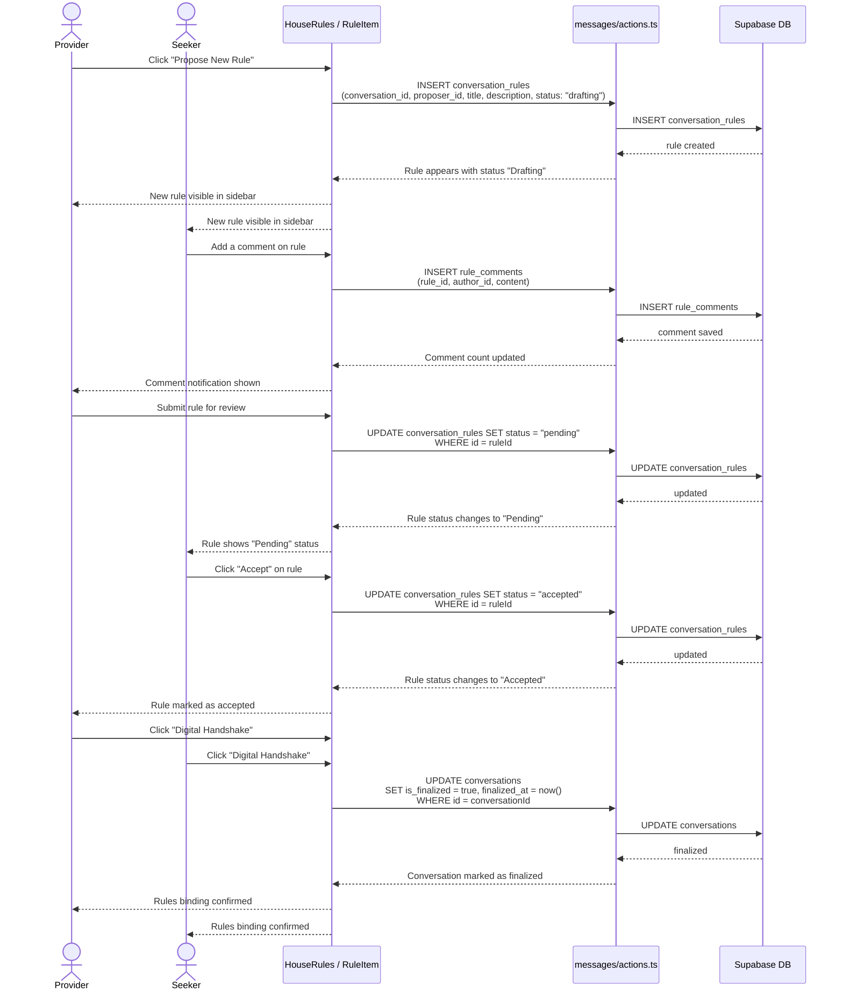

# Sequence Diagram: House Rules Flow

```mermaid
sequenceDiagram
    actor Provider
    actor Seeker
    participant UI as HouseRules / RuleItem
    participant Action as messages/actions.ts
    participant DB as Supabase DB

    %% ── Provider proposes a rule ───────────────────────────────────
    Provider->>UI: Click "Propose New Rule"
    UI->>Action: INSERT conversation_rules<br/>(conversation_id, proposer_id, title, description, status: "drafting")
    Action->>DB: INSERT conversation_rules
    DB-->>Action: rule created
    Action-->>UI: Rule appears with status "Drafting"
    UI-->>Provider: New rule visible in sidebar
    UI-->>Seeker: New rule visible in sidebar

    %% ── Seeker comments on the rule ───────────────────────────────
    Seeker->>UI: Add a comment on rule
    UI->>Action: INSERT rule_comments<br/>(rule_id, author_id, content)
    Action->>DB: INSERT rule_comments
    DB-->>Action: comment saved
    Action-->>UI: Comment count updated
    UI-->>Provider: Comment notification shown

    %% ── Provider updates rule to pending ──────────────────────────
    Provider->>UI: Submit rule for review
    UI->>Action: UPDATE conversation_rules SET status = "pending"<br/>WHERE id = ruleId
    Action->>DB: UPDATE conversation_rules
    DB-->>Action: updated
    Action-->>UI: Rule status changes to "Pending"
    UI-->>Seeker: Rule shows "Pending" status

    %% ── Seeker accepts the rule ───────────────────────────────────
    Seeker->>UI: Click "Accept" on rule
    UI->>Action: UPDATE conversation_rules SET status = "accepted"<br/>WHERE id = ruleId
    Action->>DB: UPDATE conversation_rules
    DB-->>Action: updated
    Action-->>UI: Rule status changes to "Accepted"
    UI-->>Provider: Rule marked as accepted

    %% ── Both parties finalize (Digital Handshake) ─────────────────
    Provider->>UI: Click "Digital Handshake"
    Seeker->>UI: Click "Digital Handshake"
    UI->>Action: UPDATE conversations<br/>SET is_finalized = true, finalized_at = now()<br/>WHERE id = conversationId
    Action->>DB: UPDATE conversations
    DB-->>Action: finalized
    Action-->>UI: Conversation marked as finalized
    UI-->>Provider: Rules binding confirmed
    UI-->>Seeker: Rules binding confirmed
```
