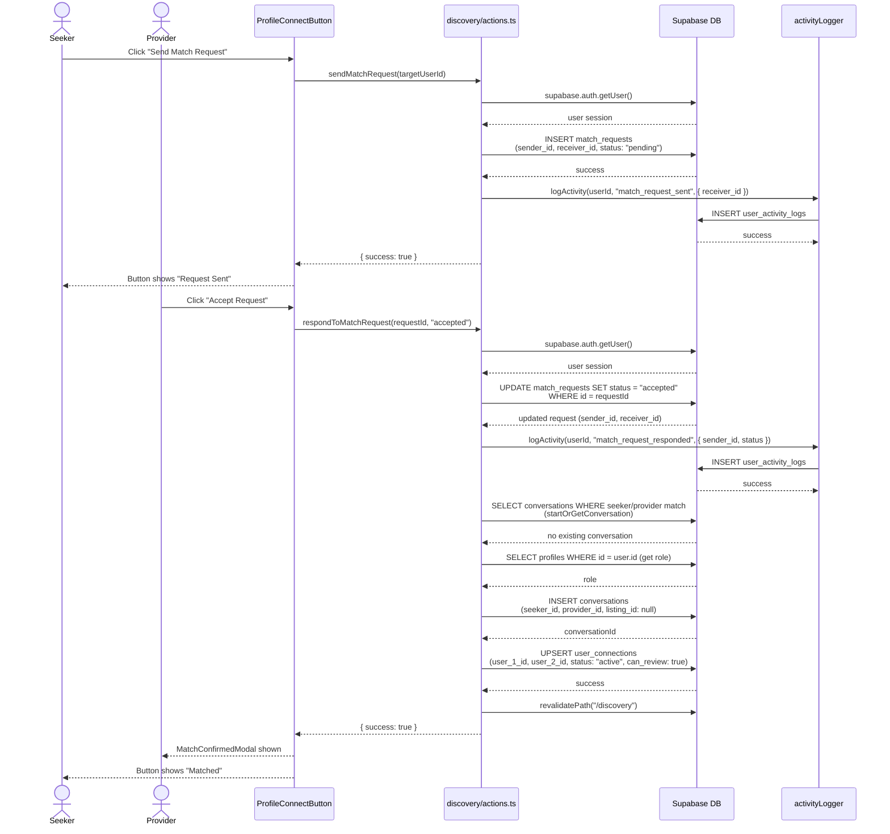

# Sequence Diagram: Match Request Flow

```mermaid
sequenceDiagram
    actor Seeker
    actor Provider
    participant UI as ProfileConnectButton
    participant Action as discovery/actions.ts
    participant DB as Supabase DB
    participant Logger as activityLogger

    %% ── Seeker sends a match request ──────────────────────────────
    Seeker->>UI: Click "Send Match Request"
    UI->>Action: sendMatchRequest(targetUserId)
    Action->>DB: supabase.auth.getUser()
    DB-->>Action: user session

    Action->>DB: INSERT match_requests<br/>(sender_id, receiver_id, status: "pending")
    DB-->>Action: success

    Action->>Logger: logActivity(userId, "match_request_sent", { receiver_id })
    Logger->>DB: INSERT user_activity_logs
    DB-->>Logger: success

    Action-->>UI: { success: true }
    UI-->>Seeker: Button shows "Request Sent"

    %% ── Provider accepts the request ──────────────────────────────
    Provider->>UI: Click "Accept Request"
    UI->>Action: respondToMatchRequest(requestId, "accepted")
    Action->>DB: supabase.auth.getUser()
    DB-->>Action: user session

    Action->>DB: UPDATE match_requests SET status = "accepted"<br/>WHERE id = requestId
    DB-->>Action: updated request (sender_id, receiver_id)

    Action->>Logger: logActivity(userId, "match_request_responded", { sender_id, status })
    Logger->>DB: INSERT user_activity_logs
    DB-->>Logger: success

    %% ── Conversation created ───────────────────────────────────────
    Action->>DB: SELECT conversations WHERE seeker/provider match<br/>(startOrGetConversation)
    DB-->>Action: no existing conversation

    Action->>DB: SELECT profiles WHERE id = user.id (get role)
    DB-->>Action: role

    Action->>DB: INSERT conversations<br/>(seeker_id, provider_id, listing_id: null)
    DB-->>Action: conversationId

    %% ── User connection created ────────────────────────────────────
    Action->>DB: UPSERT user_connections<br/>(user_1_id, user_2_id, status: "active", can_review: true)
    DB-->>Action: success

    Action->>DB: revalidatePath("/discovery")
    Action-->>UI: { success: true }

    UI-->>Provider: MatchConfirmedModal shown
    UI-->>Seeker: Button shows "Matched"
```
